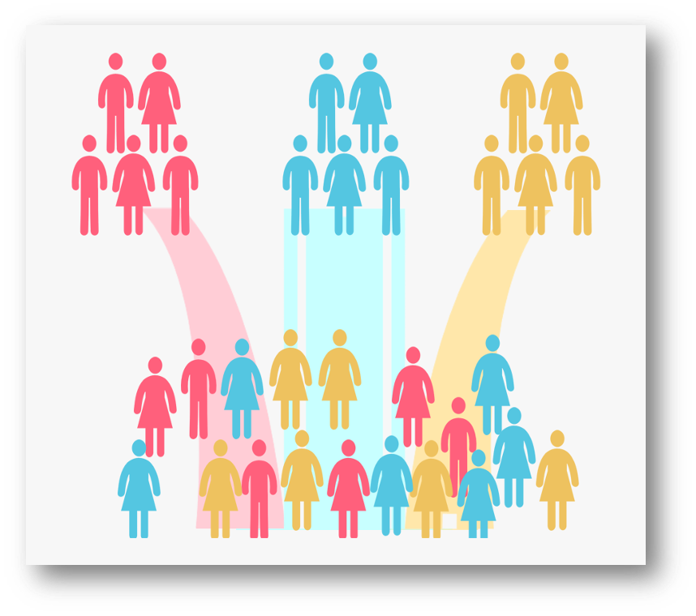

# INTRODUCTION

In this case study, we'll perform customer segmentation using k-means, a 
clustering algorithm



## Clustering
Clustering is an unsupervised machine learning task that automatically divides 
the data into clusters or groupings of similar items. It does this without
having been told what the groups should look like ahead of time. As we may not
even know what we're looking for, clustering is used for knowledge discovery 
rather than prediction. It provides an insight into the natural groupings found
within data.

## K-means algorithm

The k-means is the widest used unsupervised machine learning algorithm. It basically 
tries to minimize the distance of the points in a cluster with their centroid. 
This results in the creation of groups/segments with different characteristics (as 
different as possible)

## Business Benefits

There are a lot of benefits when using segmentation in a business context. In 
particular when a business develops a successful customer segmentation, that means that instead 
of treating all customers the same, now each customer is assigned to a cluster. 
So the business can apply different strategies to each segment/cluster, which 
contribute to improving/optimizing e.g.:

- Customer retention  
- Customer satisfaction  
- Sales revenue  
- Product pricing  


## Our problem

Our company has 368 B2B customers and we need i) Create a centralized pricing policy 
regarding different segments of customers & ii) Improve our customer satisfaction & 
retention through targeted marketing campaigns. 

The stakeholders decided to develop a customer segmentation to: 

- Apply different discount policies on each segment and optimize revenue  
- Design different marketing campaigns on each segment to optimize customer retention & satisfaction

All the data used for the analysis are anonymized. 

## Initial ETL & Feature engineering 

This is a very important step in every data science project, especially when performing
clustering. 

We have to work along with the stakeholders, as they will help us identify
the important customer features and how we can obtain these (via ERP, CRM systems, Surveys e.t.c).
In this step, you may spend most of your time during similar projects, as we need 
meaningful & important features to perform a successful segmentation.


## Import libraries

At first we are loading all libraries. 

```{r}

library(tidyverse)
library(ggthemes)
library(DT)
library(d3heatmap)
library(plotly)
library(ggfortify)

# Set the black & white theme for all plots
theme_set(theme_bw())

# Use it to prevent scientific notation
options(scipen = 999)

```

## Load dataset 

We'll use the final dataset, which is the result of the initial ETL & feature 
engineering step.  

We use the read_csv() function (from readr library) to read the csv file in R. 

```{r}

customers <- read_csv(file = "data/customers.csv")
```

# EXPLORATORY ANALYSIS

## Inspect the dataset 


```{r}
customers %>% glimpse()

customers %>% View()
```

All variables are anonymized. 

- customer | The customer name  
- area | The customer area  
- certifications | The number of certifications each customer's employees hold  
- last_year_revenue | Last year's total revenue of each customer  
- new_products_prop | The proportion of last year's revenue generated by each customer with new products vs total revenue
- new_products_revenue | Last year's revenue of each customer generated with new products 
- active_quarters | The total number of quarters that this customer was active (at least 1 transaction during an active quarter)  
- median_quarterly_dso | The median quarterly DSO of each customer (Days sales outstanding - measure of the average number of days that it takes a company to collect payment after a sale has been made) 
- median_quarterly_balance | The median quarterly balance of each customer (amount of money customer owes to the company at the end of the quarter)  
- total_revenue | The total revenue each customer generated (historical revenue) 
- product_cat_A_revenue | Last year's revenue of each customer generated by product category A    
- product_cat_B_revenue | Last year's revenue of each customer generated by product category B   
- product_cat_C_revenue | Last year's revenue of each customer generated by product category C  
- product_cat_D_revenue | Last year's revenue of each customer generated by product category D  


## Check for missing values

It's very important to check for missing data before our analysis. Especially 
when we planning to perform clustering, because k-means algorithm can't handle
missing data. 

```{r}
customers %>%
    map_df(~ sum(is.na(.))) %>%
    gather() %>%
    arrange(desc(value))

```

We haven't got any missing values so we can proceed. 

## Continuous variables distribution

K-means algorithm can be applied only in continuous variables. So all the variables 
that we're using are continuous. Below we check the distribution of each variable

```{r}

customers %>% 
  select(-customer, -area) %>%  
  gather(key = "Variable", value = "Value") %>%
  ggplot(aes(Value)) +
  geom_histogram(bins = 20) +
  facet_wrap(~ Variable, scales = "free") +
  labs(
    title = "Continuous variables histograms",
    x = ""
  ) 


```

We can see that most of our variables, especially currency-related variables, have a 
skewness towards large values. It would be a good idea to use a logarithmic scale. 
In any case, prior to apply clustering we need to scale our variables, so it 
is a good idea to create some plots using logarithmic scale. 

```{r}
customers %>% 
  select(-customer, -area) %>%  
  gather(key = "Variable", value = "Value") %>%
  ggplot(aes(log(Value))) +
  geom_histogram(bins = 20) +
  facet_wrap(~ Variable, scales = "free") +
  labs(
    title = "Continuous variables histograms with log values",
    x = ""
  ) 

```
A lot of the log-transformed variables (almost all revenue-related vars) are close to a normal distribution (Log-normal). 

## Correlogram 

It is a chart that presents correlation between the dataset variables. 

```{r}
library(corrplot)

exclude <- c("customer", "area")

corrplot(cor(select(customers, -exclude)), type="upper", order="hclust")

```

We can see that there are some strong correlations between the variables. Especially
between all currency-related variables. It seems that almost all currency 
variables are following the same pattern. 

## Joy plot

Essentially presents overlapping area charts, which make it easy to compare all
the distributions

```{r}

select(customers, -exclude) %>% 
  mutate_all(scale) %>% 
  gather(key = "variable", value = "value") %>% 
  mutate(value = scale(value)) %>% 
  ggplot(aes(x = value,
             y = variable, fill = ..x..)) +
  ggridges::geom_density_ridges_gradient(rel_min_height = 0.0) +
  viridis::scale_fill_viridis(name = "") +
  ggridges::theme_ridges(font_size = 13, grid = TRUE) +
  theme(axis.title.y = element_blank(),
        axis.title.x = element_blank(),
        axis.text.x = element_text(size = 12),
        text = element_text(family = "mono")) +
  scale_x_continuous(limits = c(-2, 2))+
  labs(title = 'Density plots of variables',
       subtitle = 'All values are scaled')
```

Here we can see again that the distribution of all revenue-related variables are 
similar. 


# MODELLING

At first we'll discover the optimal number of clusters for our dataset. There are
two techniques for that, elbow plot & silhouette plot.

## Determining optimal number of clusters with elbow plot

Plot of total within cluster sum of squares (the sum of euclidean distances 
between each observation and the centroid corresponding to the cluster to which
the observation is assigned)

```{r echo=FALSE, message=FALSE, warning=FALSE, paged.print=FALSE}
library(purrr)
library(cluster)

# Compute the distance matrix
cluster_data <- dist(scale(select(customers, -exclude)))

# Use map_dbl to run many models with varying value of k (centers)
tot_withinss <- map_dbl(1:10,  function(k){
  model <- kmeans(x = cluster_data, centers = k)
  model$tot.withinss
})

# Generate a data frame containing both k and tot_withinss
elbow_df <- data.frame(
  k = 1:10,
  tot_withinss = tot_withinss
)


ggplot(elbow_df, aes(x = k, y = tot_withinss)) +
  geom_line() +
  geom_point() +
  scale_x_continuous(breaks = 1:10) +
  labs(y = "Total within sum of squares",
       title = "Check for optimal num. of segments (Elbow plot)",
       subtitle = "Stop adding new segments when the additional information is not significant",
       x = "Number of segments")

```

The idea here is that we stop adding new segments when the additional information 
(increase on total within sum of squares) is not significant. In this case 4 & 5 clusters seems OK. 

Finally we choose to perform the segmentation with 5 segments because:  

i) it is among the optimal number of segments &
ii) satisfies our business needs. 


## Build the model with k = 5 


```{r}
set.seed(42)

# Build a k-means model for the customers with a k of 5
model_customers <- kmeans(scale(select(customers, -exclude)), centers = 5)

```


## Heatmap of cluster centers 

This is an easy way to check the differences & similarities of all segments. The 
center of the cluster is the average of all points (elements) that belong to that
cluster. All values are scaled 

```{r echo=FALSE, message=FALSE, warning=FALSE, paged.print=FALSE}

d3heatmap(
      model_customers$centers, 
      scale = "column",
      dendrogram = "both",
      Colv=FALSE,
      color = scales::col_quantile("Greens", NULL, 6), 
      cexRow = .6, 
      yaxis_font_size = 10)

```

The more green - the higher the value. 

-	Segment 3 containing just 5 customers. These are our "top" customers. They tend to generate way more revenue, have a lot of certifications, purchase quite a big proportion of new products and have a high DSO  

-	Segment 2 contains 27 customers. They are "close to the top" customers as they tend to generate high revenue, maintain a high number of certifications, purchase quite a big proportion of new products and have a high DSO  

-	Segment 4 contains 106 customers. They are the "average" customers as they tend to generate average revenues, have a small number of certifications, purchase an average proportion of new products and have an average DSO  

-	Segment 1 contains 87 customers. They are the "promising" customers as they tend to generate a relatively low revenue, have a small number of certifications, but they purchase a very high proportion of new products and have a small DSO  

-	Segment 5 contains 143 customers. They are the "under-performing" customers as they tend to generate a very low revenue, have a very small number of certifications, purchase a very low proportion of new products and have an small DSO  


## Table of variables 

**Below there is a table with information about all clusters (with all variables)**


```{r}
# Extract the vector of cluster assignments from the model
clust_customers <- model_customers$cluster

# Build the segment_customers dataframe
segment_customers <- mutate(select(customers, -exclude), cluster = clust_customers)

# Calculate the mean for each category
segment_customers %>% 
  group_by(cluster) %>% 
  add_tally() %>% 
  summarise_each(funs(round(mean(.),2))) %>% 
  select(1, "n", everything()) %>% 
  arrange(-last_year_revenue) %>% 
  datatable(filter = 'top', options = list(pageLength = 5, autoWidth = TRUE, dom = 'pt'))

```


## PCA (Principal components analysis)

It is a dimensionality reduction algorithm, that allows you to summarize the
information content in large datasets by means of a smaller set of features that 
can be more easily visualized and analyzed. It will assist us in segmentation
visualization (Biplot). 

- It will find linear combination of variables to create principal components
- These Principal components capture the most variation in a dataset and are uncorrelated


```{r}

pca_customers <- prcomp(scale(select(customers, -exclude)))
summary(pca_customers)
```


## Biplot 

This plot shows all the original observations plotted on the first 2 principal 
components (which contain almost 75% of the original dataset variance). It also 
shows the original features mapped as vectors.


```{r fig.height=7, fig.width=10}

  ggplotly(
        autoplot(pca_customers, loadings = TRUE, loadings.label = TRUE) +
          labs(title = "Biplot of customers and variables") +
          theme_fivethirtyeight())

```

It shows that there are 3 distinct groups of variables:
- active_quarters & median_dso
- new_products_prop 
- All the revenue-related variables 


## "Business" Biplot 

```{r fig.height=7, fig.width=10}


ggplotly(
          pca_customers$x %>%
          as.data.frame() %>%
          mutate(CLIENT = customers$customer,
                 Cluster = as.factor(segment_customers$cluster),
                 revenue = segment_customers$last_year_revenue,
                 newbusiness = segment_customers$new_products_prop,
                 certifications = segment_customers$certifications) %>%
          select(CLIENT, Cluster, PC1, PC2, revenue, newbusiness, certifications) %>%
          ggplot(aes(PC1, PC2, color = Cluster, text = paste(CLIENT, "\n Revenue: ",
                                                             # scales::dollar(revenue, prefix = "€"), 
                                                             revenue, 
                                                             "\n New Prod. Rev.:", newbusiness, "%\nCertifications:",
                                                             certifications,
                                                             sep = "") )) +
          
          stat_ellipse(aes(label = Cluster, group = Cluster), type = "norm", level = 0.70) +
          geom_point()+
          theme_fivethirtyeight() +
          labs(title = "Business Biplot of customers",
               x = "",
               y = "") +
          scale_color_discrete(name = "Segments") +
          theme_hc(),
        
        tooltip = "text")


```

We can see here how "well" the segments are separated. For example:  
- Segment 3 ("top customers") are well separated from the rest  
- Segment 2 ("Close to top customers") are just next to the top customers. 
- Segments 1 & 5 are overlapping. 

Almost all segments are clearly distinguished.

## Customer segmentation table

```{r}

customers %>% 
  mutate(cluster = clust_customers) %>% 
  select(customer, area, cluster, everything()) %>% 
  View()

```

Reports the segment & details of all customers. 

# CONCLUSIONS

The chosen "optimal" number of clusters is 5, which is within the business objectives
of the company. It is crucial to work with the stakeholders while running the analysis, 
in order to produce a useful output. 


## Segments overview

Segment | # customers | Description       | Performance evaluation             
   3    |        5    | "Top"             | Very high on all vars
   2    |       27    | "Close to top"    | High on all vars
   4    |      106    | "Average"         | Average on all vars  
   1    |       87    | "Promising"       | Very high new products rev. & low on the rest
   5    |      143    | "Under-performers"| Low on all vars

## Sugestions

- We show that almost all revenue-related variables are correlated. We could remove some or most of these variables as they don't really help the segmentation process.  

- In order to improve our segmentation we need more features. We can meet with the stakeholders and work close to them to find or generate some more features.  

- We can try more clustering algorithms, like hierarchical clustering, DBSCAN etc. 


